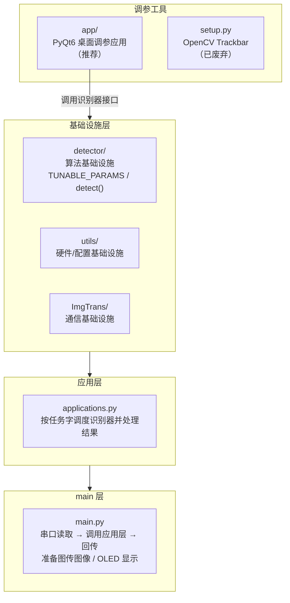

# GC2026

GC2026 是一个基于 OpenCV 的计算机视觉项目，主要用于物料颜色检测、圆环检测以及图像传输。项目支持在 Linux（嵌入式板卡）和 Windows 环境下运行，可通过串口接收任务指令并返回识别结果。

此外，项目包含一个跨平台桌面调参应用（`app/`），用于通过 UDP 接收图传画面、可视化调节参数、远程部署配置和管理服务。

***

## 功能简介

- **颜色物料检测**：支持红（R）、绿（G）、蓝（B）三种颜色的物料识别与定位
- **圆环检测**：检测图像中的圆环目标
- **图像传输（UDP）**：支持将处理后的图像通过 UDP 实时传输到服务端
- **OLED 状态显示**：在支持的板卡上显示当前运行模式、服务端 IP 及识别结果
- **参数调试工具**：提供 PyQt6 桌面调参应用（`uv run app`，推荐）；旧的 OpenCV Trackbar 命令行工具（`uv run setup`）已废弃但保留兼容

***

## 环境要求

| 项目     | 要求                                   |
| ------ | ------------------------------------ |
| Python | >= 3.12                              |
| 操作系统   | Linux（推荐，用于嵌入式部署）/ Windows（用于本地开发调试） |
| 包管理器   | [uv](https://docs.astral.sh/uv/)     |

***

## 安装 uv

本项目使用 [uv](https://docs.astral.sh/uv/) 作为 Python 包管理工具。如果你还没有安装 uv，请根据你的操作系统选择以下方式之一：

### Windows

使用 PowerShell 安装：

```powershell
powershell -ExecutionPolicy ByPass -c "irm https://astral.sh/uv/install.ps1 | iex"
```

或者使用 winget：

```powershell
winget install --id=astral-sh.uv  -e
```

### Linux / macOS

使用 curl 安装：

```bash
curl -LsSf https://astral.sh/uv/install.sh | sh
```

或者使用 Homebrew（macOS）：

```bash
brew install uv
```

安装完成后，验证 uv 是否安装成功：

```bash
uv --version
```

***

## 项目环境配置

### 1. 克隆项目

```bash
git clone <你的仓库地址>
cd GC2026
```

### 2. 创建虚拟环境并安装依赖

本项目已配置好 `pyproject.toml` 和 `uv.lock`，使用 uv 一键安装依赖：

```bash
# 仅安装嵌入式主程序所需依赖
uv sync

# 如果要开发/运行桌面调参应用，需要额外安装 app 依赖
uv sync --extra app
```

该命令会自动：

- 读取 `.python-version` 文件，使用 Python 3.12
- 创建项目虚拟环境
- 根据 `uv.lock` 安装所有依赖包

> 其他可选依赖：
>
> ```bash
> uv sync --extra board  # 嵌入式 GPIO 依赖
> ```

### 3. 激活虚拟环境

在运行项目前，需要激活 uv 创建的虚拟环境：

```bash
# Windows (PowerShell)
.venv\Scripts\activate

# Linux / macOS
source .venv/bin/activate
```

或者使用 uv 直接运行命令（无需手动激活）：

```bash
uv run python app.py
```

***

## 项目结构

```
GC2026/
├── app.py                  # 桌面调参应用入口
├── main.py                 # 嵌入式主程序入口
├── applications.py         # 应用逻辑（颜色/圆环检测）
├── setup.py                # 参数调试工具入口（已废弃，仅保留兼容）
├── img_trans.py            # 图像传输入口
├── config.yaml             # 全部运行参数（现场调好的当前值）
├── pyproject.toml          # 项目配置与依赖
├── uv.lock                 # 依赖锁定文件
├── .python-version         # Python 版本指定（3.12）
├── environments.sh         # 泰山派新板一次性初始化脚本
├── core/                   # 配置桥接（main 与 app 共享，禁止引入 PyQt6）
├── app/                    # 桌面调参应用包
├── ImgTrans/               # 图像传输模块（UDP 发送/接收）
├── detector/               # 检测器模块（颜色、圆环）
├── utils/                  # 工具模块（串口、GPIO、摄像头等）
├── docs/                   # 开发/设计/部署文档
└── run_auto/               # 开机自启脚本与 systemd 服务配置
```

***

## uv run 入口一览

本项目在 `pyproject.toml` 中定义了以下入口，均可通过 `uv run <入口名>` 直接运行。

| 入口名               | 功能          | 有参数 | 状态 |
| ----------------- | ----------- | --- | --- |
| `app`             | 启动桌面调参应用   | 否   | **推荐** |
| `main`            | 启动嵌入式主程序   | 否   | 正常运行时入口 |
| `setup color`     | 交互式调节颜色检测阈值 | 是   | 已废弃（仅保留兼容） |
| `setup colorring` | 交互式调节色环检测阈值 | 是   | 已废弃（仅保留兼容） |
| `img_trans`       | 图像传输（发送/接收） | 否   | 独立调试工具 |

***

### 1. `uv run app` — 桌面调参应用（推荐）

启动 PyQt6 桌面应用，提供 UDP 图传接收、颜色/色环参数调节、配置管理、SSH 服务管理和日志查看等功能。相比命令行 Trackbar，它提供更直观的滑动条、Tab 切换、实时预览、一键保存到 `config.yaml`。

```bash
# 首次运行前确保已安装 app 依赖
uv sync --extra app

# 启动桌面应用
uv run app
```

调参流程：

1. 安装 app 依赖：`uv sync --extra app`
2. 启动：`uv run app`
3. 在左侧导航栏选择“颜色调参”或“色环调参”
4. 调整滑块，确认画面效果后点击顶部工具栏的保存按钮

> **注意**：`uv run setup color` / `uv run setup colorring`（OpenCV Trackbar）已废弃，新参数/新颜色的调试请使用桌面应用。

***

### 2. `uv run main` — 嵌入式主程序

无额外参数，启动后并行运行四个异步协程：

| 协程      | 功能                                                                   |
| ------- | -------------------------------------------------------------------- |
| 图像处理    | 从串口读取任务指令（`@...#` 格式），根据任务标识（`R`/`G`/`B`/`C`/`F`）执行物料颜色检测、圆环检测或刷新图像缓存，将结果放入发送队列 |
| OLED 显示 | 读取拨码开关切换运行模式（`main`/`debug`），在 OLED 上显示当前模式、服务端 IP 及识别结果             |
| 图像传输    | 将处理后的图像通过 UDP 发送到客户端，调试模式时直接发送原始图像                                  |
| 配置热加载   | 周期性计算 `config.yaml` 的 SHA-256，文件变化时自动重新加载检测器参数与 `udp_target_ip`，无需重启程序 |

```bash
uv run main
```

***

### 3. `uv run setup color` / `uv run setup colorring` — 命令行调参（已废弃，仅保留兼容）

打开 Trackbar 窗口，按 **`s`** 保存到 `config.yaml`，按 **`q`** 退出。

```bash
# 本地摄像头
uv run setup color --capid 0

# 远程图传（本机 IP 会作为接收端绑定地址，源码中默认为 169.254.213.183，
# 若 PC 实际 IP 不同，需修改 setup.py 中 ReceiveImgUDP 的第三个参数）
uv run setup color --remote --capip 192.168.1.100 --port 4444

# 色环参数（已废弃）
uv run setup colorring --capid 0
```

Trackbar 中的 `color` 滑条用于切换当前调参的颜色（0=R、1=G、2=B，对应 `detector/ColorDetect.py` 的 `COLOR_DICT`），每种颜色的阈值独立保存。如需增加新颜色（如黄色 Y），参见下文「task_table 与任务字扩展」中的颜色扩展步骤。

***

### 4. `uv run img_trans` — 图像传输

无额外参数。根据操作系统平台自动切换模式：

| 平台      | 行为                                                 |
| ------- | -------------------------------------------------- |
| Linux   | 在端口 `4444` 创建 UDP 图像发送器（绑定网卡从 `config.yaml` 的 `system.udp_interface` 读取，空表示所有网卡），持续从摄像头读取画面并发送 |
| Windows | 作为 UDP 图像接收器，从图传发送端接收画面并显示，按 `q` 退出                |

```bash
uv run img_trans
```

***

## 主要依赖

| 包名            | 说明          |
| ------------- | ----------- |
| opencv-python | 计算机视觉核心库    |
| numpy         | 数值计算        |
| pyserial      | 串口通信        |
| pyyaml        | YAML 配置文件解析 |
| loguru        | 日志记录        |
| click         | 命令行接口       |
| jieba         | 中文分词        |

***

## 配置文件

项目使用 `config.yaml` 存储全部运行参数，分为四部分：

- `system`：硬件与系统参数（串口、UDP、GPIO 引脚、OLED、摄像头名），由 `core/config_bridge.py` 的 `SystemConfig` 加载；
- `color`：R/G/B 三色 HSV 阈值，通过桌面应用（推荐）或已废弃的 `setup color` 调节并保存；
- `color_ring`：色环检测参数，通过桌面应用（推荐）或已废弃的 `setup colorring` 调节并保存；
- 顶层全局参数：`min_material_area`、`max_material_area`（物料轮廓面积过滤）、`need2cut_height`、`target_angle`。

> **关于 `need2cut_height` 与 `target_angle`**：这两个参数当前只被 `core/config_bridge.py` 读写持久化，**运行时代码（识别器、`main.py`）并不消费它们**，属于为后续功能（画面裁剪、偏航角补偿）预留的字段。修改它们不会改变任何识别行为。

`config.yaml` 支持热加载：主程序运行期间修改文件后，`config_watcher()` 协程会在约 1 秒内自动重新加载检测器参数与 `udp_target_ip`，无需重启。

> **仓库中的 `config.yaml` 是现场调好的当前值，不是出厂默认值**。真正的默认值唯一来源是识别器源码中的类属性（如 `TraditionalColorDetector.color_threshold`）。当配置文件缺失某个字段时，程序才回退到源码默认值。详见下文「7. 参数的存放与读取」。

`system` 段字段说明：

| 字段 | 默认值 | 说明 |
|------|--------|------|
| `serial_port` | `/dev/ttyS3` | 与主控通信的串口设备 |
| `udp_interface` | `''` | UDP 绑定网卡，空字符串表示所有网卡 |
| `udp_port` | `8080` | UDP 图传端口 |
| `udp_target_ip` | `''` | 预配置图传接收端 IP，空表示等待客户端 `connect` 握手 |
| `switch_pin` | `GPIO3-A3` | 运行模式拨码开关引脚 |
| `switch_reverse` | `true` | 是否反转开关电平 |
| `start_led_pin` | `GPIO3-A2` | main 模式指示 LED 引脚 |
| `detecting_led_pin` | `GPIO3-A4` | 检测中指示 LED 引脚 |
| `oled_i2c_port` | `2` | OLED 的 I2C 总线号 |
| `oled_i2c_address` | `60`（0x3C） | OLED 的 I2C 地址（十进制） |
| `camera_name` | `icspring camera` | 摄像头名称，通过 `v4l2-ctl --list-devices` 查看 |

示例配置（颜色段）：

```yaml
color:
  R:
    centre: 0
    error: 17
    L_S: 80
    U_S: 255
    L_V: 20
    U_V: 255
  G:
    centre: 65
    error: 17
    ...
```

***

## 串口通信协议

视觉端与 STM32 电控端通过串口（默认 `/dev/ttyS3`，115200 8N1，超时 0.5 s）通信。协议非常简单：**一帧一个任务，一帧一个结果**。

### 任务帧（电控端 → 视觉端）

```
@<任务字>#
```

- 包头 `@`，包尾 `#`，中间是**单个字符**的任务字（`R`/`G`/`B`/`C`/`F`）；
- `main.py` 的 `Uart.new_read(head="@", tail="#")` 会一直读字节直到凑齐包头包尾，中间内容就是任务字；
- 收到任务字后视觉端立即读一帧图像、执行检测、回传结果。

### 结果帧（视觉端 → 电控端）

```
@<8位数字字符串>#
```

坐标 `(x, y)` 由 `Applications.tuple2str()` 编码为固定 8 位字符串：

| 位 | 含义 |
|----|------|
| 第 1 位 | x 符号：`1` 表示非负，`0` 表示负 |
| 第 2–4 位 | x 绝对值，十进制，左侧补零凑满 3 位 |
| 第 5 位 | y 符号：同上 |
| 第 6–8 位 | y 绝对值，同上 |

示例：

| 坐标 | 编码结果 |
|------|----------|
| `(12, -115)` | `10120115` |
| `(-3, 240)` | `00031240` |
| 未识别到目标 / `F` 任务 | `FFFFFFFF` |

> **电控端解码提示**：收到 `FFFFFFFF` 表示“本次未识别到”（或 `F` 刷新任务的固定应答），不应作为坐标使用。`F` 任务本身不检测任何目标，只用于丢弃摄像头缓存中的陈旧帧，因此固定回传 `FFFFFFFF`。

***

## 拨码开关与 OLED 显示

- **拨码开关**（`system.switch_pin`，默认 `GPIO3-A3`）切换两种运行模式：
  - `main` 模式：正常响应串口任务，图传发送**识别结果可视化图像**（上侧原图+标记，下侧二值图）；
  - `debug` 模式：**不响应串口任务**，图传直接发送原始摄像头画面，用于纯看图像、调机位。
- `system.switch_reverse`（默认 `true`）用于适配拨码开关的实际接线电平：为 `true` 时 `Switch.read_status()` 返回**反转后**的电平。判断逻辑在 `main.py` 的 `board_show()` 中：`read_status()` 为真 → `debug`，为假 → `main`。如果现场拨动开关后模式与预期相反，改 `switch_reverse` 即可，不用改代码。
- **OLED 显示**三行内容：当前模式（`Main`/`Debug`）、`Server IP`、最近一次识别结果。其中 **`Server IP` 是泰山派自己的 IP**（图传服务端地址，优先取 `eth0`，其次 `wlan0`），PC 端填图传接收地址时就填这个 IP + `system.udp_port`（默认 8080）。
- 两颗 LED：`start_LED` 在 `main` 模式点亮、`debug` 熄灭；`detecting_LED` 在每次处理串口任务期间点亮，可用于肉眼观察任务是否在执行。

***

## 开发指南

> 想了解这些架构与约定**为什么**存在（设计模式、分层理由、并发模型取舍），请阅读 [`docs/DESIGN.md`](docs/DESIGN.md)。

### 1. 整体架构

GC2026 运行时分为三层：

| 层级 | 代表文件/目录 | 职责 |
|------|---------------|------|
| **main 层** | `main.py` | 程序入口与事件循环，编排图像处理 / OLED / 图传 / 配置热加载四个协程；读取串口任务、回传结果、准备待发送图像 |
| **应用层** | `applications.py` | 业务调度器，根据任务字调用对应识别器，并把识别结果转换为对外格式 |
| **基础设施层** | `utils/`、`ImgTrans/`、`detector/` | 提供硬件抽象、UDP 图传、配置加载、视觉算法等可复用能力 |

`app/`（PyQt6 桌面调参）是**推荐的调参工具**，直接调用基础设施中的识别器来调试参数并生成 `config.yaml`，**不参与 `main.py` 的运行时闭环**。`setup.py`（OpenCV Trackbar）已废弃，新颜色/新参数的调试请优先使用桌面应用。



### 2. main 层、应用层与基础设施层

#### main 层

`main.py` 是嵌入式主程序的入口，负责：

- 通过 `asyncio.gather` 并行运行四个协程：`main()`（图像处理）、`board_show()`（OLED 状态显示）、`img_trans()`（UDP 图传）、`config_watcher()`（配置热加载）；
- 在 `main()` 协程中通过 `Uart` 读取 `@...#` 格式的串口任务字；
- 根据 `task_table` 调用 `applications.py` 中的对应方法；
- 把识别结果通过 `Uart` 写回；
- 把可视化图像 `res_img` 放入 `img_need_to_send`，供 `img_trans()` 发送；
- 读取拨码开关切换 `RUN_MODE`（`main` / `debug`）。

`main.py` 本身**不包含视觉算法细节**，只负责“读任务 → 调用应用层 → 发结果 → 发图传”。

#### task_table 与任务字扩展

`main.py` 中的 `task_table` 定义了“串口任务字 → 应用层方法”的映射：

```python
task_table = {
    "R": (applications.detect_material, "R"),
    "G": (applications.detect_material, "G"),
    "B": (applications.detect_material, "B"),
    "C": (applications.detect_circle, None),
    "F": (refresh_img, None),
}
```

任务字含义：

| 任务字 | 含义 | 返回值 |
|--------|------|--------|
| `R` / `G` / `B` | 检测对应颜色色块/物料的中心坐标。**两个用途**：① 第一轮在转盘上取料时识别物料；② 第二轮码垛时用于整车定位——此时第一层物料已码好，直接以物料颜色为基准定位，而**不能用 `C`**：码垛高度下视野中会同时出现多个圆环（圆环靶标 + 已码物料边缘），`C` 可能返回其他圆环的坐标导致定位错误 | `(x, y)` 或 `None` |
| `C` | 检测地面色环靶标的中心坐标，**仅在视野中无已码物料时使用**（第一轮定位） | `(x, y)` 或 `None` |
| `F` | 刷新摄像头缓存（连续读取 5 帧丢弃旧帧），不检测目标；STM32 在切换检测场景前先发 `F`，避免拿到陈旧图像 | 始终 `None`（回写 `FFFFFFFF`） |

> **为什么第二轮码垛用颜色而不用色环**：色环检测基于霍夫圆变换，对视野中所有圆形轮廓都会响应。第一层物料码好后，物料本身（圆柱/圆角轮廓）与圆环靶标同时出现在画面中，霍夫检测无法区分"靶标圆"与"物料圆"，坐标可能跳变。颜色检测按 HSV 阈值锁定特定物料，天然排除其他圆形干扰。

每个条目是一个二元组：

- 第 1 个元素：`Applications` 的方法对象（函数指针）；
- 第 2 个元素：调用时传入的附加参数（如颜色标签），不需要时传 `None`。

当 `main()` 协程读到任务字后，会这样调用：

```python
res, res_img = await task_table[task_sign][0](
    img, task_table[task_sign][1]
)
```

**应用层方法签名要求**

被 `task_table` 指向的方法必须满足以下约定：

- 必须是协程：`async def ...`，因为 `main.py` 使用 `await` 调用；
- 第一个参数为 `self`；
- 第二个参数为 `img: cv2.typing.MatLike`，即当前帧原始图像；
- 第三个参数（可选）用于接收 `task_table` 中的附加参数，建议写成 `label=None` 并给默认值；
- 返回值必须是二元组 `(coord, draw_img)`：
  - `coord`：识别到的坐标，传 `None` 表示未识别到，或传 `(x, y)` 元组；`main.py` 会把它交给 `Applications.tuple2str()` 转换成固定长度字符串后写回串口；
  - `draw_img`：`np.ndarray` 类型可视化图像，会被 `main.py` 放入 `img_need_to_send` 通过 UDP 发送给客户端。

示例签名：

```python
async def detect_my_target(
    self,
    img: cv2.typing.MatLike,
    label=None,
) -> tuple[tuple[int, int] | None, np.ndarray]:
    ...
    return (cx, cy), draw_img
```

**新增一个任务字的标准流程**：

1. 在 `applications.py` 的 `Applications` 类中新增一个业务方法，签名一般为：
   ```python
   async def detect_my_target(self, img: cv2.typing.MatLike, label=None) -> tuple[tuple|None, np.ndarray]:
       ...
       return coord, draw_img
   ```
2. 在 `main.py` 的 `task_table` 中新增映射：
   ```python
   task_table = {
       ...
       "M": (applications.detect_my_target, None),
   }
   ```
3. 如果该方法依赖新的识别器，还需要：
   - 在 `Applications.__init__()` 中实例化并加载该识别器；
   - 在 `detector/` 中实现该识别器并声明 `TUNABLE_PARAMS`；
   - （可选）在 `app/ui/main_window.py` 的 `DETECTOR_REGISTRY` 中注册，以在桌面端提供调参页面。

**给颜色检测器添加新颜色（以黄色 Y 为例）**

颜色检测器 `TraditionalColorDetector` 按颜色标签保存独立的 HSV 阈值组（`color_threshold` 字典），添加新颜色不需要新识别器，桌面应用也会按 `TUNABLE_PARAMS.color_groups` 自动生成对应颜色的 Tab。

1. **`config.yaml`**：在 `color:` 段下新增 `Y:` 条目（初始值可先抄一组再调）：
   ```yaml
   color:
     Y:
       centre: 30   # 黄色在 OpenCV HSV 中的色相中心约 30（0-180 刻度）
       error: 12
       L_S: 80
       U_S: 255
       L_V: 80
       U_V: 255
   ```
2. **`detector/ColorDetect.py`**：
   - 在类属性 `color_threshold` 中加入 `"Y"` 的默认阈值字典（键名必须与 `config.yaml` 一致）；
   - 在 `TUNABLE_PARAMS` 的 `color_groups=["R", "G", "B"]` 中追加 `"Y"`（桌面调参应用会自动生成 Y 的颜色 Tab）；
   - 若仍需使用已废弃的 `uv run setup color`，在 `COLOR_DICT` 中追加 `3: 'Y'`，并把 `createTrackbar()` 里 `"color"` 滑条上限从 `2` 改为 `3`。

   > **无需修改 `core/config_bridge.py`**：`DEFAULT_COLOR_PARAMS` 是从 `TUNABLE_PARAMS.color_groups` 自动推导的（见 `_default_color_params()`），追加颜色分组后桌面应用的默认配置、Tab 渲染都会自动跟随。
3. **`main.py`** 的 `task_table` 注册任务字：
   ```python
   task_table = {
       ...
       "Y": (applications.detect_material, "Y"),
   }
   ```
4. **调参**：运行 `uv run app`（推荐），在"颜色调参"页面切换到 Y Tab，调好阈值后保存到 `config.yaml`。

之后电控端发送 `@Y#` 即可触发黄色物料检测，返回值格式与 R/G/B 完全一致。

> **原理提示**：`detect_material(img, color_label)` 通过 `update_range(color_label)` 从 `color_threshold[color_label]` 读取该颜色的阈值组，再由色相中心 ± 容差算出 HSV 上下限；当 `centre - error < 0` 或 `centre + error > 180` 时会自动拆分为两段色相区间（红色跨 0°/180° 的情形），因此红色等跨边界颜色无需特殊处理。

#### 应用层

`applications.py` 中的 `Applications` 类是**业务方法集合**：

- 持有所有识别器实例（如 `colorDetector`、`colorRingDetector`），并在初始化时加载 `config.yaml`；
- 为每种任务提供封装好的业务方法（如 `detect_material()`、`detect_circle()`），供 `main.py` 的 `task_table` 调用；
- 在方法内部调用识别器的 `detect()` / `visualize()`，得到坐标 `coord` 和可视化图像 `draw_img`；
- 通过 `tuple2str()` 把坐标转换为固定长度字符串，供 `main.py` 回写串口。

应用层**不负责“看到哪个任务字就调用谁”**，这个映射由 `main.py` 的 `task_table` 维护；应用层也**不直接读写串口、不直接发送图传、不直接操作 GPIO**，这些工作全部交给 `main.py` 和基础设施层。

#### 基础设施层

基础设施层是被上层调用的**可复用能力集合**，包含三类：

| 子层 | 目录 | 说明 |
|------|------|------|
| **算法基础设施** | `detector/` | 识别器基类 `Detect` 与具体识别器，提供纯 OpenCV 视觉服务 |
| **硬件/配置基础设施** | `utils/` | 摄像头 `Cap`、串口 `Uart`、GPIO、OLED、`ConfigLoader` 等 |
| **通信基础设施** | `ImgTrans/` | UDP 分片图传 `SendImgUDP` / `ReceiveImgUDP` |

识别器虽然封装的是视觉算法，但它不持有业务状态、不参与任务调度，只是被应用层调用的“算法服务”，因此归入基础设施层。

### 3. 调参工具如何调用识别器

- **`setup.py`**：直接导入识别器并调用 `createTrackbar()`，用 OpenCV 窗口调参；
- **`app/`**：`app/ui/main_window.py` 维护 `DETECTOR_REGISTRY`，为每个注册识别器自动创建一个 `DetectorTunerScreen`；`DetectorTunerScreen` 通过识别器的通用接口完成参数读写和实时预览。

### 4. 什么是识别器（Detector）

**识别器是基础设施层中封装了单一视觉任务的算法单元**。在 GC2026 中，它同时向两类消费者提供服务：

- **运行时消费者**：`applications.py` 在串口任务到来时调用它，得到坐标和带标记的可视化图像；
- **调参消费者**：`app/` 和 `setup.py` 读取它的参数定义，动态生成滑条和预览界面。

因此，识别器必须是**自描述、自读写、自预览、自持久化**的：

- **自描述**：通过 `TUNABLE_PARAMS` 告诉外部自己有哪些可调参数、范围、分组；
- **自读写**：通过 `get_tunable_value()` / `set_tunable_value()` 让外部不需要知道参数是类属性还是嵌套字典；
- **自预览**：通过 `detect()` / `draw_overlay()` / `format_detection_info()` 输出可拼接的预览图和文字信息；
- **自持久化**：通过 `load_config()` / `save_config()` 与 `config.yaml` 交互。

当前已实现的识别器：

| 文件 | 类 | 任务 | 参数形态 |
|------|-----|------|----------|
| `detector/ColorDetect.py` | `TraditionalColorDetector` | 物料颜色检测 | 按颜色 `R/G/B` 分组 + `global` 全局参数 |
| `detector/ColorRingDetect.py` | `ColorRingDetector` | 地面色环检测 | 按处理阶段 `预处理/霍夫检测/后处理` 分组 |

### 5. 识别器开发契约

新建识别器必须继承 `Detect`（`detector/Detect.py`），并至少实现以下接口：

```python
class MyDetector(Detect):
    # 1. 可调参数声明
    TUNABLE_PARAMS = DetectorSchema(...)

    # 2. 参数读写（平铺参数可直接用基类默认实现）
    def get_tunable_value(self, key, section=None): ...
    def set_tunable_value(self, key, value, section=None): ...
    def load_tunable_from_app_config(self, app_config): ...
    def save_tunable_to_app_config(self, app_config): ...

    # 3. 运行时/预览接口（必须实现）
    async def detect(self, frame: np.ndarray) -> tuple[Any, np.ndarray]: ...
    def draw_overlay(self, frame, result, binary) -> np.ndarray: ...
    def format_detection_info(self, result) -> str: ...

    # 4. 配置持久化（推荐）
    def load_config(self, config: str | dict): ...
    def save_config(self, path: str): ...
```

`Detect` 基类已提供默认的 `visualize()`，内部会把 `draw_overlay()` 的输出与 `binary` 纵向拼接，供 `applications.py` 直接调用。

参数 Schema 在 `detector/schema.py` 中定义：

- `ParamDef`：单个参数，包含 `key`（属性名/配置 key）、`label`（中文显示名）、`param_type`（`int`/`float`）、`min`/`max`、`step`、`decimals`、`scale`、`group`、`section` 等；
- `DetectorSchema`：一个识别器的全部参数，支持三种布局：
  - `color_groups` 非空 → `color-tabs` 布局（颜色检测）；
  - `groups` 非空 → `group-tabs` 布局（色环检测）；
  - 两者皆空 → `flat` 单面板布局。

详细的模板和示例请见 [`docs/DEVELOPMENT.md`](docs/DEVELOPMENT.md)。

### 6. App 如何动态调参

桌面调参应用 `app/` 不会为每个识别器写死页面，而是通过 `DetectorSchema` 动态渲染：

1. **注册**：在 `app/ui/main_window.py` 的 `DETECTOR_REGISTRY` 中添加识别器类、页面标题、图标等信息；
2. **自动创建页面**：`MainWindow` 遍历注册表，为每个条目实例化 `DetectorTunerScreen(detector_cls, title, config_bridge, frame_source_manager)`；
3. **加载当前值**：`DetectorTunerScreen` 创建识别器实例后，调用 `load_tunable_from_app_config(app_config)` 把 `config.yaml` 中的值写入识别器；
4. **渲染 UI**：根据 `tunable_schema()` 返回的 Schema 自动选择 `color-tabs` / `group-tabs` / `flat` 布局，并创建滑条；
5. **响应修改**：用户拖动滑条时，UI 调用 `set_tunable_value(key, value, section)` 把值写回识别器；300 ms debounce 后调用 `detect(frame)` 生成预览；
6. **保存**：点击“保存”时，UI 调用 `save_tunable_to_app_config(app_config)`，再由 `ConfigBridge.save()` 把 `config.yaml` 落盘。

> **关键约定**：新增识别器**必须**加入 `DETECTOR_REGISTRY` 才能在桌面端出现调参页面。未注册的识别器即使实现了完整契约，App 也不会自动发现。

### 7. 参数的存放与读取

GC2026 的参数来源有三层，且**默认值以识别器源码为唯一来源**：

1. **默认值**：识别器源码中的类属性。
   - 颜色检测：`TraditionalColorDetector.color_threshold["R"/"G"/"B"]` 和 `min_material_area` / `max_material_area`；
   - 色环检测：`ColorRingDetector.erode_iter`、`gaussian_kernel_size` 等类属性。
   - 修改这里会同时影响：首次运行默认值、`ConfigBridge` 推导的默认值、“恢复默认”按钮恢复的值。

2. **运行时当前值**：识别器实例的属性或嵌套字典。
   - 应用层和调参工具直接读写这些运行时值；
   - `set_tunable_value()` 负责把 UI 传回的 `float` 按 `param_type` 截断为 `int`，并把 `scale` 还原为实际值。

3. **配置文件 `config.yaml`**：持久化当前参数。
   - `ConfigBridge` / `AppConfig` 负责把 YAML 映射到识别器可读取的结构；
   - 颜色参数在 `color.R/G/B` 下，色环参数在 `color_ring` 下，全局参数（如 `min_material_area`）在顶层。

示例 `config.yaml` 结构：

```yaml
color:
  R:
    centre: 0
    error: 12
    L_S: 41
    U_S: 255
    L_V: 29
    U_V: 255
  G: { ... }
  B: { ... }

color_ring:
  erode_iter: 1
  gaussian_kernel_size: 5
  ...

min_material_area: 5940
max_material_area: 300000
need2cut_height: 0
target_angle: 46
```

> **注意**：`ParamDef.scale` 表示“UI 显示值 × scale = 实际值”。例如 `min_material_area` 的 `scale=10`，UI 滑条范围是 0–30000，但实际写入识别器的是 0–300000。

### 8. 新增识别器的标准流程

1. 在 `detector/` 新建文件，继承 `Detect`，实现算法与契约接口；
2. 在识别器源码中声明 `TUNABLE_PARAMS` 并设置类属性默认值；
3. （可选）在 `app/core/config_bridge.py` 的 `AppConfig` 中新增对应字段，让参数能被 `config.yaml` 持久化；
4. 在 `applications.py` 新增调度方法，把识别器接入 `Applications`；
5. 在 `main.py` 的 `task_table` 中注册新的任务字；
6. 若需要桌面调参页面，在 `app/ui/main_window.py` 的 `DETECTOR_REGISTRY` 中注册识别器。

更多细节（完整模板、接入桌面应用、常见陷阱）请阅读 [`docs/DEVELOPMENT.md`](docs/DEVELOPMENT.md)。

***

## 注意事项

1. **平台差异**：
   - Linux 环境下使用 `utils.Cap()` 初始化摄像头（通过 `v4l2-ctl` 按 `system.camera_name` 匹配设备），并支持 GPIO、OLED、串口等硬件操作
   - Windows 环境下使用 `cv2.VideoCapture(0)`，GPIO/OLED 自动降级为 no-op 占位对象
2. **串口配置**：
   - 默认串口为 `/dev/ttyS3`（泰山派），在 `config.yaml` 的 `system.serial_port` 中修改
   - 波特率固定为 **115200 8N1**（`utils/UART.py` 默认值），超时 0.5 秒，断开后自动重连
3. **网络配置**：
   - UDP 图传端口与网卡在 `config.yaml` 的 `system.udp_port` / `system.udp_interface` 中配置
   - `udp_interface` 留空表示绑定所有网卡；OLED 上显示的 IP 优先取 `eth0`，其次 `wlan0`
   - `system.udp_target_ip` 支持热加载：修改 `config.yaml` 后约 1 秒内生效
4. **泰山派部署**：完整的刷机、WiFi、权限、开机自启流程见 [`docs/DEPLOYMENT.md`](docs/DEPLOYMENT.md)

***

## 许可证

本项目采用 **GPL v3 或更高版本（GPL-3.0-or-later）**，完整许可证文本见根目录 [LICENSE](LICENSE) 文件（与项目源码文件头部的许可声明一致）。
